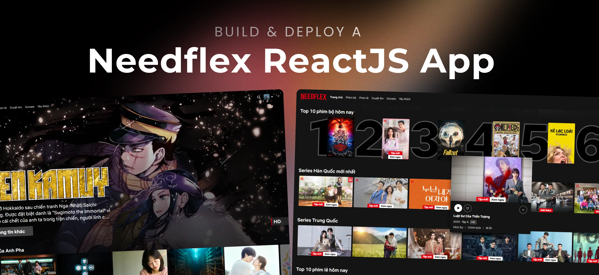

<div align="center">
  <br />
  
  <br />

  <div>
    
    
    
    
    
    
  </div>

  <h3 align="center">Needflex</h3>

  <p align="center">
    A Netflix-inspired online movie streaming platform built with React,
    focusing on performance optimization, modern UI/UX, and real-world frontend architecture.
  </p>
</div>

---

## Demo

**Needflex** is deployed and accessible at: **https://needflex.site**

---

## Tech Stack

- **React** – Component-based UI development
- **Vite** – Fast build tool and development server
- **Tailwind CSS** – Utility-first styling framework
- **Firebase** – Authentication & Cloud Firestore
- **Public Movie APIs** – Ophim & TMDB

---

## Features

- Browse trending, popular, and categorized movies
- Search and filter content easily
- View detailed movie pages with trailers and metadata
- Stream movies using `.m3u8` sources
- Continue Watching – Save and resume movie playback progress per user
- Favorite Movies – Save and manage a personal movie watchlist per user
- Firebase Authentication (Email/Password, Google)
- Responsive Netflix-style UI with optimized loading

---

## Quick Start

### Prerequisites

- Git
- Node.js (v18+)
- npm

### Clone the Repository

```bash
git clone https://github.com/anhphapap/needflex.git
cd needflex
```

### Install Dependencies

```bash
npm install
```

### Environment Variables

Create a `.env` file from the example:

```bash
cp .env.example .env
```

Configure Firebase services:

- Enable **Authentication** (Email/Password, Google)
- Create **Cloud Firestore Database**

Fill in Firebase credentials in the `.env` file.

### Run the Project

```bash
npm run dev
```

Open **http://localhost:5173** in your browser.

---

## API Data Sources

- **Ophim API** – Movie lists, metadata, and streaming sources

  - https://ophim17.cc/api-document

- **TMDB API** – Trending data, posters, backdrops, and extended metadata
  - https://developer.themoviedb.org

---

## License

This project is created for learning and personal portfolio purposes.
